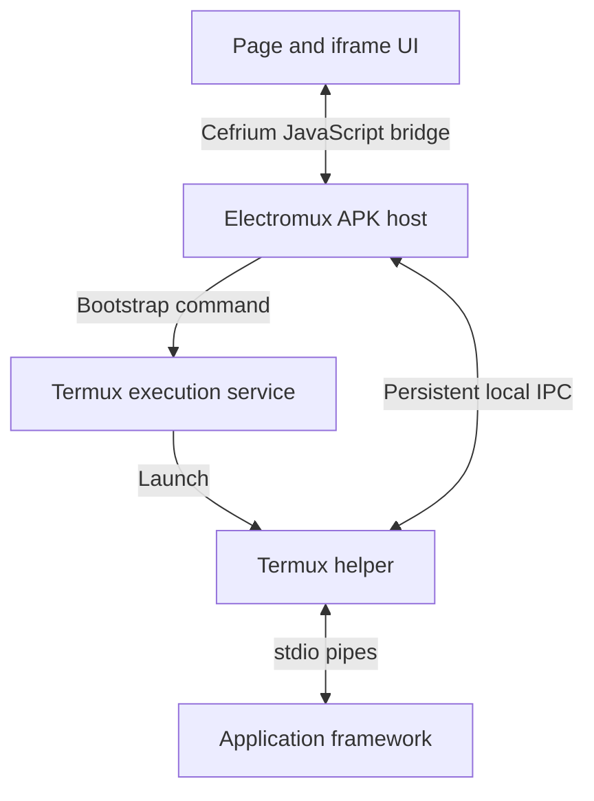

# Electromux: onboarding draft

**Status:** Design proposal, not an implemented SDK.  
**Date:** October 6, 2026.  
**Initial consumer:** TE2 Termux, a new Electromux-based Android app installed alongside the existing TE2 Cefrium and TE2 Gecko clients.

## Project intent

Electromux is a reusable Android application host that combines Cefrium rendering with a backend running in Termux. An application builds on Electromux to display its HTML/JavaScript UI, start and control its framework in Termux, and exchange messages with that framework through a native bridge.

The intended installation model resembles Termux:Tasker: the final application APK has its own package identity, uses the signing certificate compatible with the installed Termux distribution, and declares the shared user ID com.termux. Cefrium supplies the embedded Chromium engine; Electromux supplies the application hosting and Termux integration.

TE2 is the first consumer, but Electromux's public contract should accommodate other Termux-backed applications. Application-specific editor logic, project state, and framework services belong to the consuming application.

Electromux is not a replacement for the existing TE2 Cefrium app. The new host has its own APK/application ID and can be installed beside it. Cefrium remains its rendering dependency; the existing TE2 Cefrium and GeckoView packages remain intact.

The consumer app's launcher/display name is **TE2 Termux**. **Electromux** names the reusable host/library, not the TE2 app; its application ID remains to be selected during prototype setup.

## Motivation

The original exploration used Termux:GUI to host WebView content and communicate with a helper in Termux. Its content-delivery experiments addressed cleartext-security restrictions in that arrangement; generated HTML delivery is not part of Electromux's intended architecture.

Electromux provides a reusable component with an owned APK, an application entry point, a Cefrium browser surface, explicit process lifecycle operations, and a dedicated messaging API. Like the desktop Electron host, it loads the consumer's application assets and connects the frontend to its backend. The host controls browser configuration and local asset delivery. Termux:GUI is a reference for CLI-to-Android integration rather than a required dependency.

The aim is an Electron-like application arrangement on Android: an embedded Chromium frontend connected to native application processes in Termux. Backend implementations may use Rust, Python, C/C++, or another Termux runtime.

## Agreed architectural direction

- Electromux lives in its own reusable repository.
- Consuming projects, initially TE2, incorporate Electromux as a Git submodule.
- Electromux incorporates a pinned Cefrium source checkout as a nested submodule.
- The final APK uses Termux-compatible signing and the shared UID installation model.
- A Termux helper bridges the Android host connection and the framework's stdio pipes.
- Consumer application assets load through the host's local asset-serving integration, independently of backend message transport.
- The native host owns application startup and exposes the frontend/backend messaging bridge; consumer applications retain their own page and iframe composition.

Component names, method names, transport framing, and extraction boundaries below are proposals to refine during implementation.

## Repository and build ownership

| Proposed component | Responsibility |
| --- | --- |
| electromux-core | Framework sessions, bootstrap, lifecycle state, IPC, and protocol handling |
| electromux-cefrium | Cefrium surface integration, page bridge, and local asset delivery |
| electromux-gradle | Consuming application's signing, manifest, dependencies, and Cefrium build configuration |
| vendor/cef-android | Pinned upstream Cefrium source submodule |
| termux-helper | Adapter between Android host IPC and application stdio |
| sample-app | Small executable example of the complete hosting contract |

The runtime components can be Android libraries. Signing and the shared UID take effect on the **final application APK**, not on a library by itself. The build plugin should apply the agreed configuration to each consuming application and verify its resulting manifest and signing identity.

Each consumer retains its own application ID. Sharing a UID with Termux does not require using Termux's application ID or replacing the Termux APK.

Cefrium's application Gradle plugin generates Chromium resource classes in the consuming app module. Electromux's build integration must arrange that requirement as well as the SDK dependency. Pin the source revision, SDK/native artifacts, and Gradle plugin as one tested combination.

Keeping Cefrium source as a submodule does not require rebuilding Chromium for every consumer build. Ordinary builds can use pinned compiled artifacts; source builds and integration patches can have a separate workflow.

TE2 currently keeps its Cefrium build separate from its Gecko build because their Android toolchains differ. Preserve that separation during extraction unless the consuming build is deliberately migrated to a compatible toolchain. A Git submodule alone does not isolate Gradle plugin versions.

## Installation identity

For the initial GitHub-Termux-compatible build:

1. Sign the final APK with the test signing key published for Termux's GitHub builds.
2. Declare android:sharedUserId="com.termux" on the root manifest element.
3. Retain the consumer's distinct application ID.
4. Install alongside Termux and plugins with compatible signing certificates.

This is the identity relationship used by the Termux plugin family. Android permits applications with matching certificates and the same shared UID to access one another's data. Each APK still has its own components and lifecycle; Electromux must establish an explicit communication channel.

The published GitHub key does not match F-Droid's signing key. This draft targets the GitHub-compatible installation family. Android has deprecated sharedUserId, so this installation contract must be checked on the Android versions Electromux supports.

## Runtime arrangement



The framework and helper communicate through ordinary pipe-backed stdin/stdout. The helper reads framework messages and writes replies or events. It also maintains the separate IPC connection to the APK. This architecture does not require passing a pipe descriptor to the browser bindings.

A private Unix-domain socket is the proposed first APK-to-helper transport for the shared UID deployment. Its endpoint should be scoped to a framework session, and its runtime directory should come from the configured Termux environment. Confirm filesystem and SELinux access on the supported devices before making that transport a public contract.

Existing TE2 Socket.IO communication can remain behind an adapter in the additional host. Electromux should define its message and lifecycle contract independently of that implementation.

## Bootstrap and lifecycle

The APK owns the request to start a framework. The framework's supervisor owns application workers and orderly shutdown.

Proposed startup sequence:

1. The host creates a session identity and prepares its IPC endpoint.
2. A Termux launcher adapter invokes the bootstrap helper through the selected Termux execution-service interface.
3. The helper connects, exchanges protocol metadata, and launches or attaches to the configured framework.
4. The framework reports semantic readiness.
5. The host enables backend-dependent application interaction when readiness is reported. Consumer assets and the static application shell can load in parallel with backend startup.

The initial shared-UID prototype targets the direct TermuxService execution path used by Termux:Tasker, with an explicit command, argument array, working directory and background app-shell runner. Its access must be demonstrated on supported devices. Termux's public RUN_COMMAND interface is a distinct optional adapter with its own permission and allow-external-apps requirements, not an automatic fallback. Matching identity alone does not implement command execution. The investigated baseline and pinned reference sources are recorded in docs/apps/electromux/PLAN.md.

The initial lifecycle contract should support start, attach, status, stop, and detach. Repeated start requests for the same live session should attach or return its status. A stop request targets that framework session and lets its supervisor terminate owned workers.

Closing the UI and stopping the framework are separate operations. A consumer chooses its policy explicitly. Connection loss should produce a disconnected state; it should not automatically destroy framework state that the consumer expects to survive.

Use distinct lifecycle states such as starting, ready, stopping, stopped, disconnected, and failed. Report actionable failures such as unavailable Termux, launch refusal, incompatible protocol, and readiness timeout.

## Messaging contract

Define a small versioned protocol with requests, responses, and unsolicited events. Each request carries a correlation ID; responses and completion events identify the corresponding request or operation.

Illustrative request:

```json
{
  "jsonrpc": "2.0",
  "id": 42,
  "method": "framework.status",
  "params": {
    "sessionId": "editor-session"
  }
}
```

Suggested initial operations:

| Operation | Meaning |
| --- | --- |
| framework.start | Launch or attach to the configured framework session |
| framework.status | Read session state and readiness |
| framework.stop | Request orderly framework shutdown |
| app.request | Dispatch a consumer-defined backend request |
| app.event | Deliver a consumer-defined notification |

Use explicit framing on both the local socket and stdio streams. A length-prefixed UTF-8 JSON representation is a reasonable first implementation. Keep diagnostics on stderr so they cannot corrupt the helper's stdout protocol. Negotiate protocol version during connection establishment and define message size limits.

Cefrium exposes window.cefriumQuery for page-to-native requests and evaluateJavaScript for native-to-page execution. Wrap those facilities in Electromux's public page API. Long operations should acknowledge acceptance promptly and complete through correlated events, keeping Android's UI thread responsive. Do not assume evaluateJavaScript returns a JavaScript result.

## Application loading and assets

Electromux loads the consuming application's HTML/JavaScript entry point into Cefrium, analogous to the Electron desktop host. The consumer supplies its built assets; Electromux supplies the native entry point, browser lifecycle, local asset-serving integration, and backend connection. It does not generate HTML documents or replace iframe documents to deliver backend output.

The existing TE2 local asset relay is the initial reference for bundled dependencies and browser-origin handling. Relative URLs, module imports, workers, stylesheets, images, fonts, and persistent storage must retain their existing loading semantics during extraction. Dynamic backend traffic remains separate from local asset delivery.

Page and iframe composition remain consumer-owned. Preserve existing bridge identity and origin validation, and route responses to the intended application presentation rather than making generic iframe-document management part of the host contract.

## Referencing TE2 and adding a separate host

The current reference is TE2's android/cefrium client on main, reviewed during this proposal. Record an exact source commit before extraction.

Existing pieces to evaluate include the Cefrium native query dispatcher, browser lifecycle handling, local asset delivery, and persistent runtime connection. Extract the generic hosting behavior behind interfaces rather than copying the complete TE2 activity into a public SDK.

TE2 supplies its framework launch specification, assets, editor and project logic, backend services, and consumer-specific RPC handlers. Electromux supplies the browser host, Termux integration, session lifecycle, and transport adapters.

Reuse generic reference patterns behind interfaces in the new host, without removing or replacing the existing client. Its bootstrap and pipe-backed hosting path belong to the separate Electromux-based app. Do not reuse the existing client's application ID or alter its signing/UID to install the new app.

## First prototype and acceptance

Build the smallest sample that proves the complete arrangement:

1. Install a correctly signed sample APK alongside a compatible Termux installation.
2. Launch a helper and minimal framework from a native Start action.
3. Complete the IPC handshake and report framework readiness.
4. Load the sample application's bundled assets through the Cefrium host.
5. Send a frontend request through the native bridge and helper to the framework, then route its reply back to the initiating frontend.
6. Deliver a backend event and update the running UI without reloading its document.
7. Request orderly shutdown and report completion.
8. Disconnect and reconnect the UI according to the configured session policy.

Once this sample works, add the separate Electromux-based TE2 app and expand the contract only where real application requirements justify it. Continue supporting the existing Cefrium and GeckoView clients alongside it.

## References

- [TE2 Cefrium client and runtime contract](https://github.com/mrsurge/termux-extensions-2/blob/main/android/cefrium/README.md)
- [TE2 Cefrium build configuration](https://github.com/mrsurge/termux-extensions-2/blob/main/android/cefrium/build.gradle.kts)
- [Cefrium source](https://codeberg.org/cefrium/cef-android)
- [Cefrium integration guide](https://cefrium.com/quickstart/)
- [Cefrium browser API](https://cefrium.com/docs/com/cefrium/CefriumBrowser.html)
- [Termux:Tasker manifest](https://github.com/termux/termux-tasker/blob/master/app/src/main/AndroidManifest.xml)
- [Termux RUN_COMMAND interface](https://github.com/termux/termux-app/wiki/RUN_COMMAND-Intent)
- [Termux installation and GitHub signing key documentation](https://github.com/termux/termux-app#installation)
- [Android shared UID documentation](https://developer.android.com/guide/topics/manifest/manifest-element#uid)
